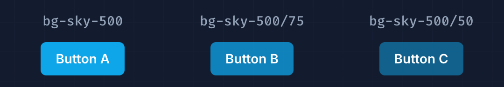
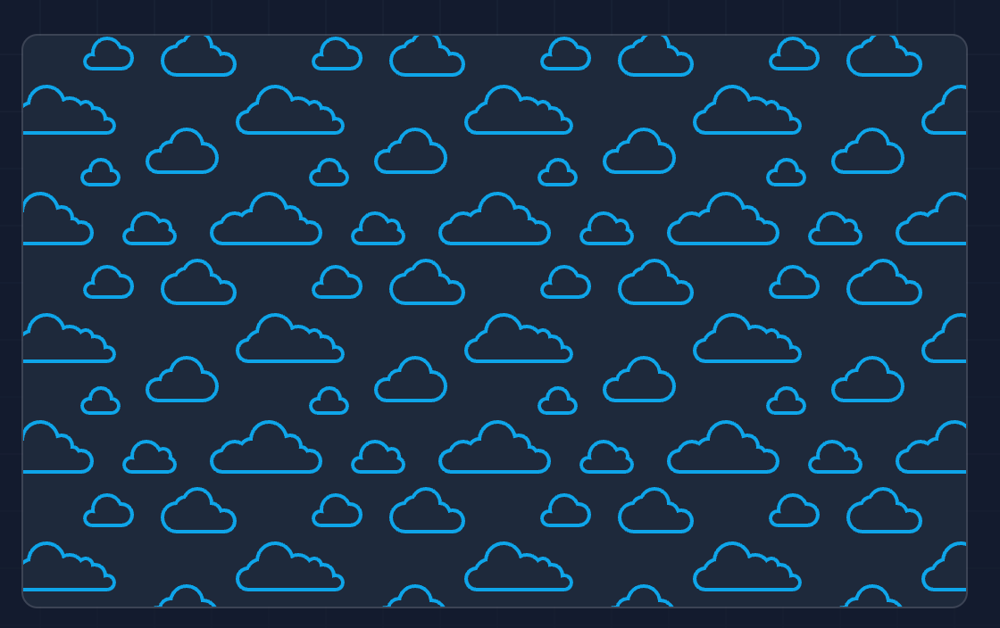
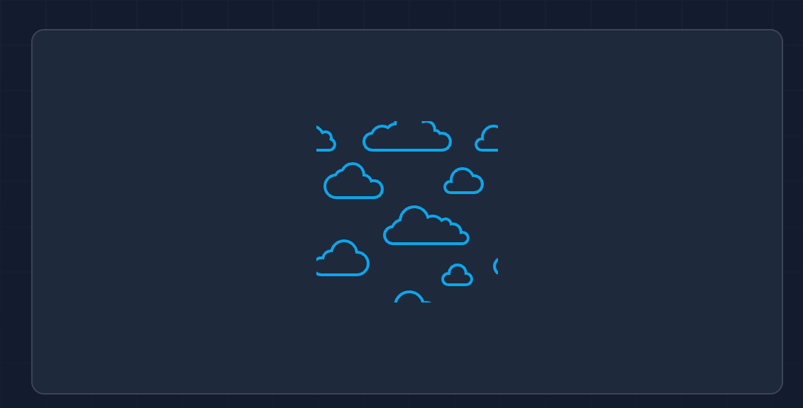
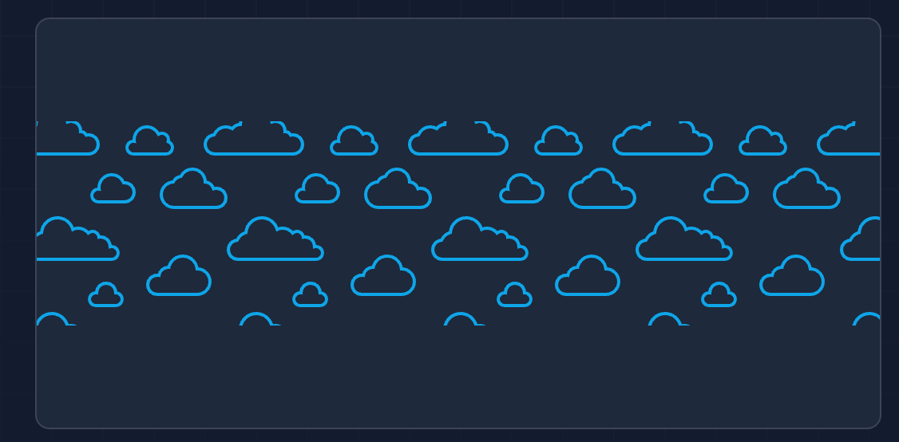
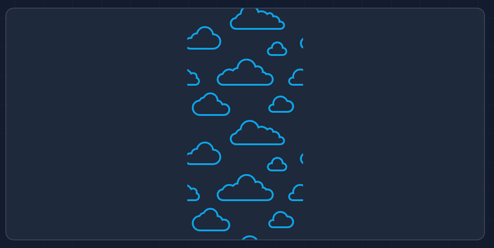

# Background

| Class          | Properties                          |
| -------------- | ----------------------------------- |
| bg-inherit     | background-color: inherit;          |
| bg-current     | background-color: currentColor;     |
| bg-transparent | background-color: transparent;      |
| bg-black       | background-color: rgb(0 0 0);       |
| bg-white       | background-color: rgb(255 255 255); |
| bg-slate-50    | background-color: rgb(248 250 252); |
| bg-slate-100   | background-color: rgb(241 245 249); |

## 透明度

```html
<button class="bg-sky-500/100 ..."></button>
<button class="bg-sky-500/75 ..."></button>
<button class="bg-sky-500/50 ..."></button>
```



## Background Repeat

| Class           | Properties                    |
| --------------- | ----------------------------- |
| bg-repeat       | background-repeat: repeat;    |
| bg-no-repeat    | background-repeat: no-repeat; |
| bg-repeat-x     | background-repeat: repeat-x;  |
| bg-repeat-y     | background-repeat: repeat-y;  |
| bg-repeat-round | background-repeat: round;     |
| bg-repeat-space | background-repeat: space;     |

### Repeat

```html
<div class="bg-repeat ..." style="background-image: url(...)"></div>
```



### No Repeat

```html
<div class="bg-no-repeat bg-center ..." style="background-image: url(...)"></div>
```



### Repeat Horizontally

```html
<div class="bg-repeat-x bg-center ..." style="background-image: url(...)"></div>
```



### Repeat Vertically

```html
<div class="bg-repeat-y bg-center ..." style="background-image: url(...)"></div>
```

