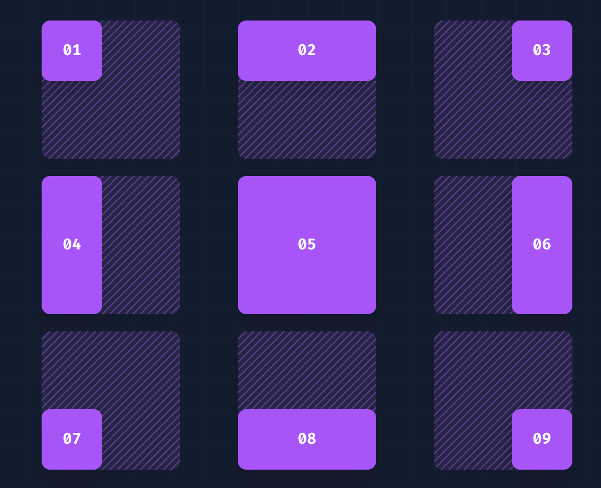
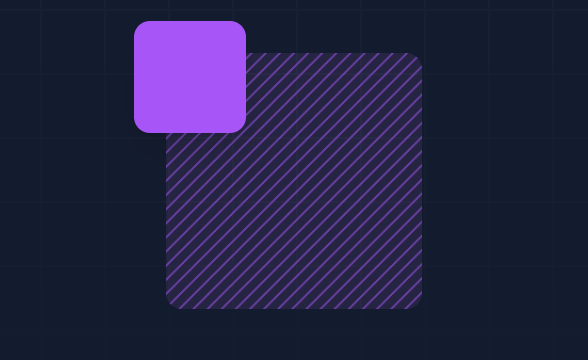
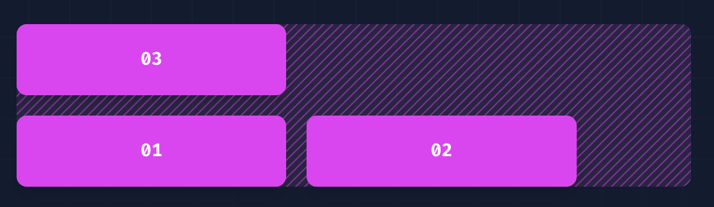

# Container

| Class     | Breakpoint   | Properties         |
| --------- | ------------ | ------------------ |
| container | None         | width: 100%;       |
|           | sm (640px)   | max-width: 640px;  |
|           | md (768px)   | max-width: 768px;  |
|           | lg (1024px)  | max-width: 1024px; |
|           | xl (1280px)  | max-width: 1280px; |
|           | 2xl (1536px) | max-width: 1536px; |

## 使用方式

```html
<div class="container mx-auto">
  <!-- ... -->
</div>
```

## Box Sizing

| Class       | Properties               |
| ----------- | ------------------------ |
| box-border  | box-sizing: border-box;  |
| box-content | box-sizing: content-box; |

## Display

| Class        | Properties             |
| ------------ | ---------------------- |
| block        | display: block;        |
| inline-block | display: inline-block; |
| inline       | display: inline;       |
| flex         | display: flex;         |
| inline-flex  | display: inline-flex;  |
| table        | display: table;        |

## Float

| Class       | Properties           |
| ----------- | -------------------- |
| float-start | float: inline-start; |
| float-end   | float: inline-end;   |
| float-right | float: right;        |
| float-left  | float: left;         |


## Object Fit

| Class          | Properties           |
| -------------- | -------------------- |
| object-contain | object-fit: contain; |
| object-cover   | object-fit: cover;   |
| object-fill    | object-fit: fill;    |

## Overflow

| Class              | Properties           |
| ------------------ | -------------------- |
| overflow-auto      | overflow: auto;      |
| overflow-hidden    | overflow: hidden;    |
| overflow-clip      | overflow: clip;      |
| overflow-visible   | overflow: visible;   |
| overflow-scroll    | overflow: scroll;    |
| overflow-x-auto    | overflow-x: auto;    |
| overflow-y-auto    | overflow-y: auto;    |
| overflow-x-hidden  | overflow-x: hidden;  |
| overflow-y-hidden  | overflow-y: hidden;  |
| overflow-x-clip    | overflow-x: clip;    |
| overflow-y-clip    | overflow-y: clip;    |
| overflow-x-visible | overflow-x: visible; |
| overflow-y-visible | overflow-y: visible; |
| overflow-x-scroll  | overflow-x: scroll;  |
| overflow-y-scroll  | overflow-y: scroll;  |

## Position

| Class    | Properties          |
| -------- | ------------------- |
| fixed    | position: fixed;    |
| absolute | position: absolute; |
| relative | position: relative; |
| sticky   | position: sticky;   |

## Top / Right / Bottom / Left

| Class     | Properties               |
| --------- | ------------------------ |
| inset-0   | inset: 0px;              |
| inset-x-0 | left: 0px; right: 0px;   |
| inset-y-0 | top: 0px; bottom: 0px;   |
| start-0   | inset-inline-start: 0px; |
| end-0     | inset-inline-end: 0px;   |
| top-0     | top: 0px;                |
| right-0   | right: 0px;              |
| bottom-0  | bottom: 0px;             |
| left-0    | left: 0px;               |



```html
<!-- Pin to top left corner -->
<div class="relative h-32 w-32 ...">
  <div class="absolute left-0 top-0 h-16 w-16 ...">01</div>
</div>

<!-- Span top edge -->
<div class="relative h-32 w-32 ...">
  <div class="absolute inset-x-0 top-0 h-16 ...">02</div>
</div>

<!-- Pin to top right corner -->
<div class="relative h-32 w-32 ...">
  <div class="absolute top-0 right-0 h-16 w-16 ...">03</div>
</div>

<!-- Span left edge -->
<div class="relative h-32 w-32 ...">
  <div class="absolute inset-y-0 left-0 w-16 ...">04</div>
</div>

<!-- Fill entire parent -->
<div class="relative h-32 w-32 ...">
  <div class="absolute inset-0 ...">05</div>
</div>

<!-- Span right edge -->
<div class="relative h-32 w-32 ...">
  <div class="absolute inset-y-0 right-0 w-16 ...">06</div>
</div>

<!-- Pin to bottom left corner -->
<div class="relative h-32 w-32 ...">
  <div class="absolute bottom-0 left-0 h-16 w-16 ...">07</div>
</div>

<!-- Span bottom edge -->
<div class="relative h-32 w-32 ...">
  <div class="absolute inset-x-0 bottom-0 h-16 ...">08</div>
</div>

<!-- Pin to bottom right corner -->
<div class="relative h-32 w-32 ...">
  <div class="absolute bottom-0 right-0 h-16 w-16 ...">09</div>
</div>
```

也可以使用`负值`

```html
<div class="relative h-32 w-32 ...">
  <div class="absolute h-14 w-14 -left-4 -top-4 ..."></div>
</div>
```



## Z-index

| Class  | Properties     |
| ------ | -------------- |
| z-0    | z-index: 0;    |
| z-10   | z-index: 10;   |
| z-20   | z-index: 20;   |
| z-30   | z-index: 30;   |
| z-40   | z-index: 40;   |
| z-50   | z-index: 50;   |
| z-auto | z-index: auto; |

也同样适用于`负值`

## Flex Wrap

| Class             | Properties               |
| ----------------- | ------------------------ |
| flex-wrap         | flex-wrap: wrap;         |
| flex-wrap-reverse | flex-wrap: wrap-reverse; |
| flex-nowrap       | flex-wrap: nowrap;       |

```html
<div class="flex flex-wrap">
  <div>01</div>
  <div>02</div>
  <div>03</div>
</div>
```


### wrap-reverse

```html
<div class="flex flex-wrap-reverse">
  <div>01</div>
  <div>02</div>
  <div>03</div>
</div>
```

