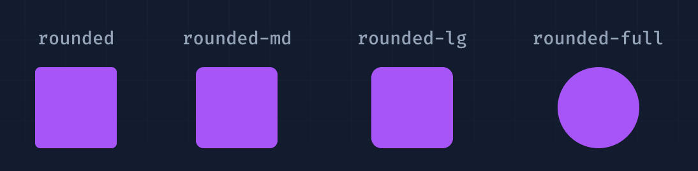
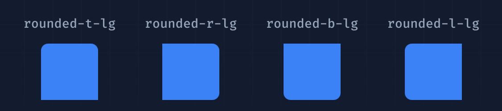
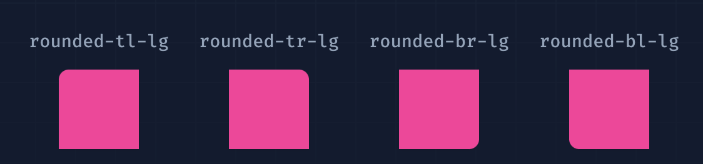
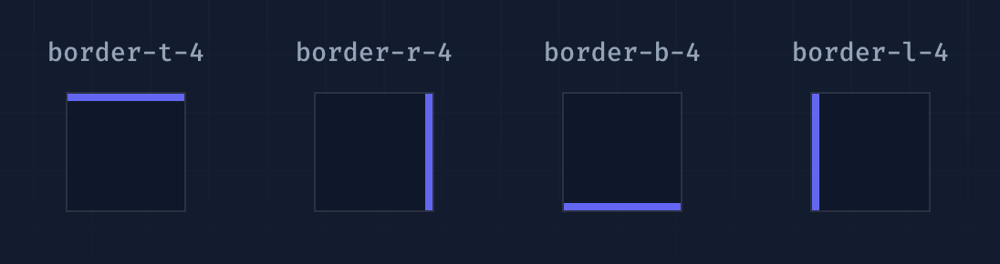
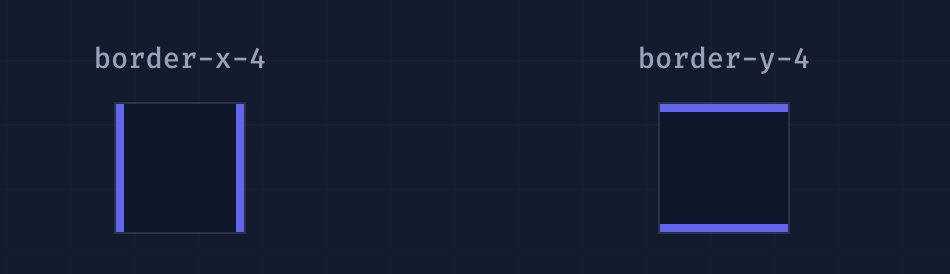
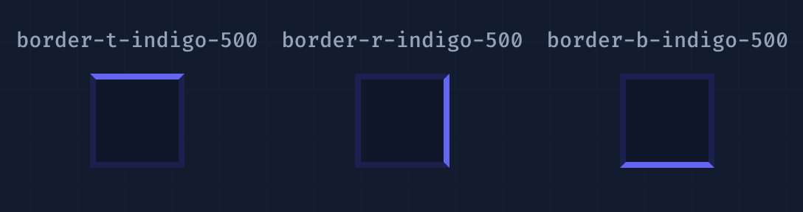
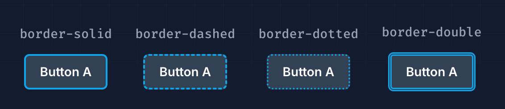

# Border

## Border Radius

| Class        | Properties                       |
| ------------ | -------------------------------- |
| rounded-none | border-radius: 0px;              |
| rounded-sm   | border-radius: 0.125rem; /*2px*/ |
| rounded      | border-radius: 0.25rem; /*4px*/  |
| rounded-md   | border-radius: 0.375rem; /*6px*/ |
| rounded-lg   | border-radius: 0.5rem; /*8px*/   |
| rounded-xl   | border-radius: 0.75rem; /*12px*/ |
| rounded-2xl  | border-radius: 1rem; /*16px*/    |
| rounded-3xl  | border-radius: 1.5rem; /*24px*/  |
| rounded-full | border-radius: 9999px;           |



### Pill Buttons

```html
<button class="rounded-full ...">Save Changes</button>
```


### 部分圆角

```html
<div class="rounded-t-lg ..."></div>
<div class="rounded-r-lg ..."></div>
<div class="rounded-b-lg ..."></div>
<div class="rounded-l-lg ..."></div>
```




### 单边圆角

```html
<div class="rounded-tl-lg ..."></div>
<div class="rounded-tr-lg ..."></div>
<div class="rounded-br-lg ..."></div>
<div class="rounded-bl-lg ..."></div>
```



## Border Width

| Class      | Properties                                       |
| ---------- | ------------------------------------------------ |
| border-8   | border-width: 8px;                               |
| border     | border-width: 1px;                               |
| border-x-2 | border-left-width: 2px; border-right-width: 2px; |
| border-x   | border-left-width: 1px;border-right-width: 1px;  |
| border-y-2 | border-top-width: 2px; border-bottom-width: 2px; |
| border-y   | border-top-width: 1px; border-bottom-width: 1px; |
| border-t-2 | border-top-width: 2px;                           |
| border-t   | border-top-width: 1px;                           |
| border-r-2 | border-right-width: 2px;                         |
| border-r   | border-right-width: 1px;                         |
| border-b-2 | border-bottom-width: 2px;                        |
| border-b   | border-bottom-width: 1px;                        |
| border-l-2 | border-left-width: 2px;                          |
| border-l   | border-left-width: 1px;                          |

### 单边边框

```html
<div class="border-t-4 border-indigo-500 ..."></div>
<div class="border-r-4 border-indigo-500 ..."></div>
<div class="border-b-4 border-indigo-500 ..."></div>
<div class="border-l-4 border-indigo-500 ..."></div>
```



### 水平或垂直边框

```html
<div class="border-x-4 border-indigo-500 ..."></div>
<div class="border-y-4 border-indigo-500 ..."></div>
```




## Border Color

| Class              | Properties                      |
| ------------------ | ------------------------------- |
| border-inherit     | border-color: inherit;          |
| border-current     | border-color: currentColor;     |
| border-transparent | border-color: transparent;      |
| border-black       | border-color: rgb(0 0 0);       |
| border-white       | border-color: rgb(255 255 255); |
| border-slate-50    | border-color: rgb(248 250 252); |


```html
<input class="border-2 border-rose-500 ...">
```


搭配上方的`单边边框` `水平边框`可以衍生出

```html
<div class="border-4 border-indigo-200 border-t-indigo-500 ..."></div>
<div class="border-4 border-indigo-200 border-r-indigo-500 ..."></div>
<div class="border-4 border-indigo-200 border-b-indigo-500 ..."></div>
<div class="border-4 border-indigo-200 border-l-indigo-500 ..."></div>
```




## Border Style

| Class         | Properties            |
| ------------- | --------------------- |
| border-solid  | border-style: solid;  |
| border-dashed | border-style: dashed; |
| border-dotted | border-style: dotted; |
| border-double | border-style: double; |
| border-hidden | border-style: hidden; |
| border-none   | border-style: none;   |

```html
<div class="border-solid border-2 border-sky-500 ..."></div>
<div class="border-dashed border-2 border-sky-500 ..."></div>
<div class="border-dotted border-2 border-sky-500 ..."></div>
<div class="border-double border-4 border-sky-500 ..."></div>
```

