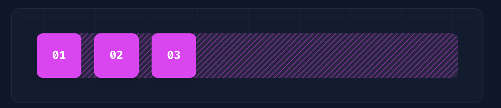
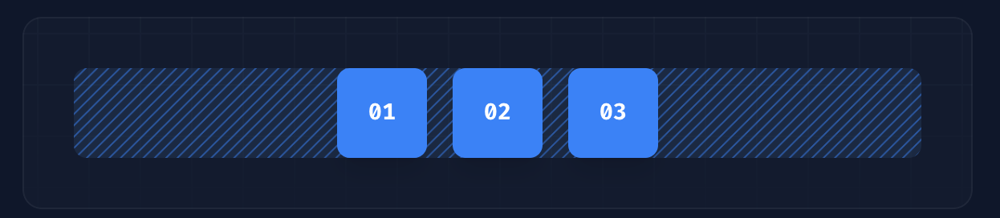
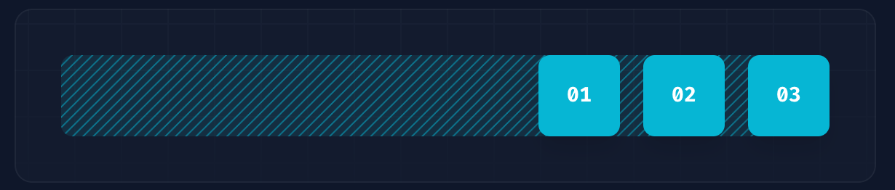
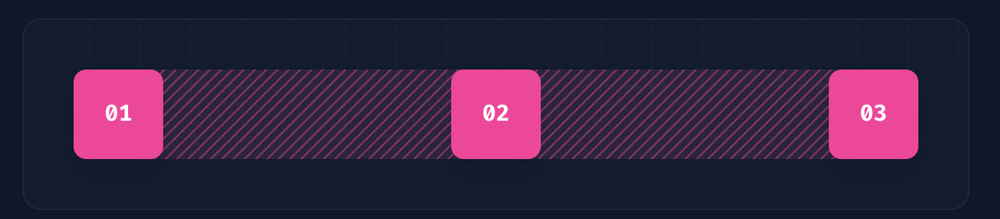

# Flex布局

`flex`布局是我们在项目中使用比较多的布局方式,以`左贡`代码为例

```css
.pipe-box {
  display: flex;
  flex-direction: column;
  gap: 8px;
}
```

这里通过flex`竖向`布局，每个子元素间距为`8px`。

如果使用tailwindcss，那么等效代码为

```html
<div class="flex flex-col space-y-2"></div>
```

显而易见的是, tailwindcss的书写更为简洁高效，同时节省了代码行数，让外人看起来更`钻业`


## Justify Content

| Class           | Properties                      |
| --------------- | ------------------------------- |
| justify-normal  | justify-content: normal;        |
| justify-start   | justify-content: flex-start;    |
| justify-end     | justify-content: flex-end;      |
| justify-center  | justify-content: center;        |
| justify-between | justify-content: space-between; |
| justify-around  | justify-content: space-around;  |
| justify-evenly  | justify-content: space-evenly;  |
| justify-stretch | justify-content: stretch;       |


十分好记，`掐头去尾`

### justify-start

```html
<div class="flex justify-start ...">
  <div>01</div>
  <div>02</div>
  <div>03</div>
</div>
```



### justify-center

```html
<div class="flex justify-center ...">
  <div>01</div>
  <div>02</div>
  <div>03</div>
</div>
```



### justify-end

```html
<div class="flex justify-end ...">
  <div>01</div>
  <div>02</div>
  <div>03</div>
</div>
```



### justify-between

```html
<div class="flex justify-between ...">
  <div>01</div>
  <div>02</div>
  <div>03</div>
</div>
```



### justify-around

```html
<div class="flex justify-around ...">
  <div>01</div>
  <div>02</div>
  <div>03</div>
</div>
```


### justify-evenly

```html
<div class="flex justify-evenly ...">
  <div>01</div>
  <div>02</div>
  <div>03</div>
</div>
```


## Align Items

| Class          | Properties               |
| -------------- | ------------------------ |
| items-start    | align-items: flex-start; |
| items-end      | align-items: flex-end;   |
| items-center   | align-items: center;     |
| items-baseline | align-items: baseline;   |
| items-stretch  | align-items: stretch;    |

十分好记，`双尾`

## 其他常用的类

`shrink-0` 等效为 `flex-shrink: 0`

`shrink` 等效为 `flex-shrink： 1`

`flex-grow` 同理
