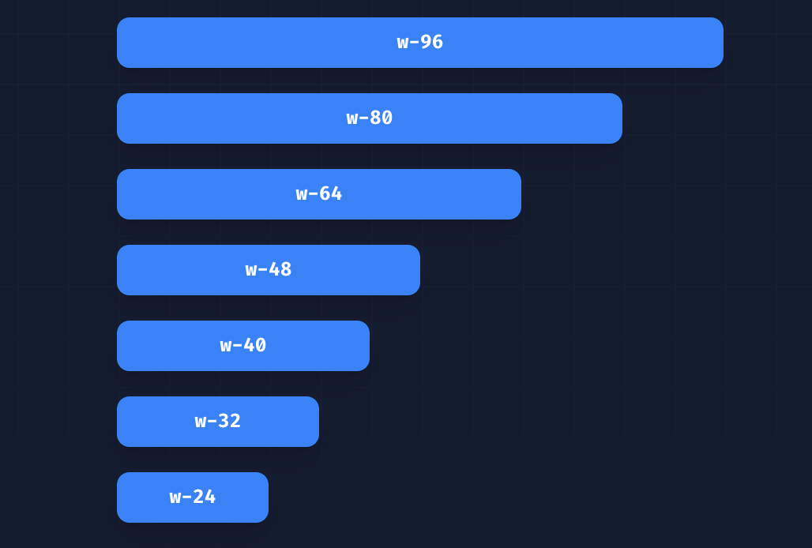
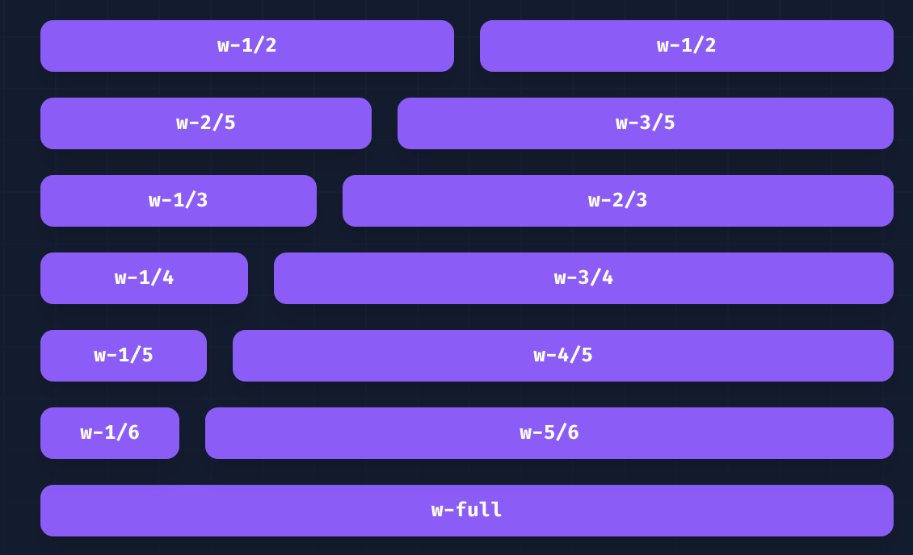
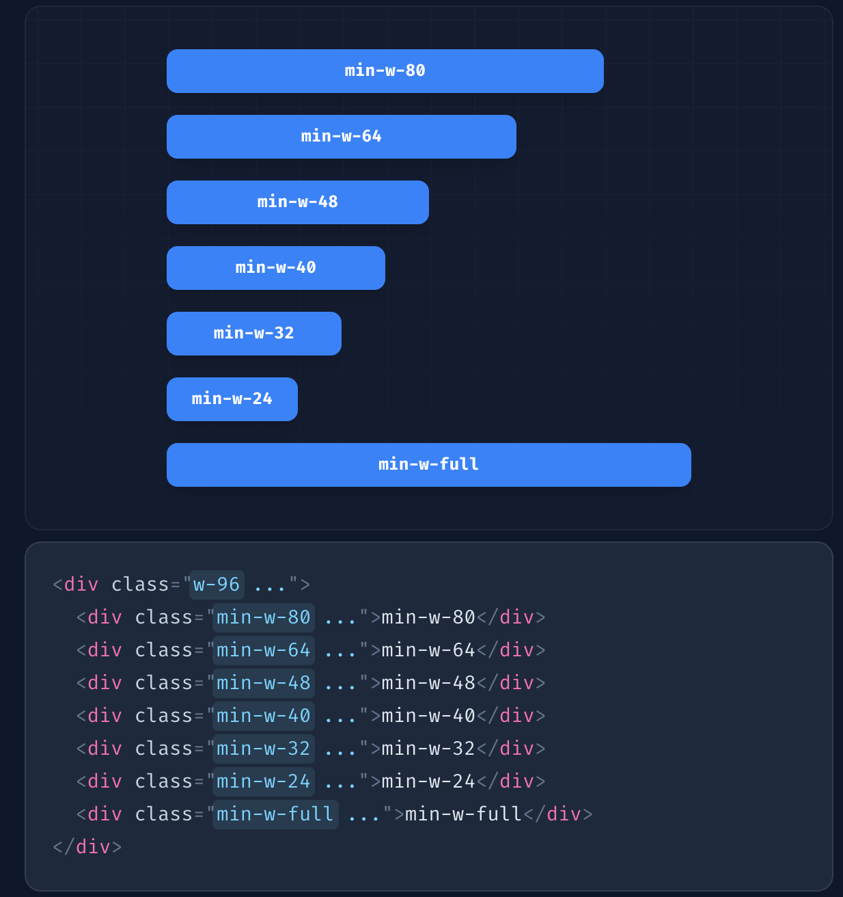
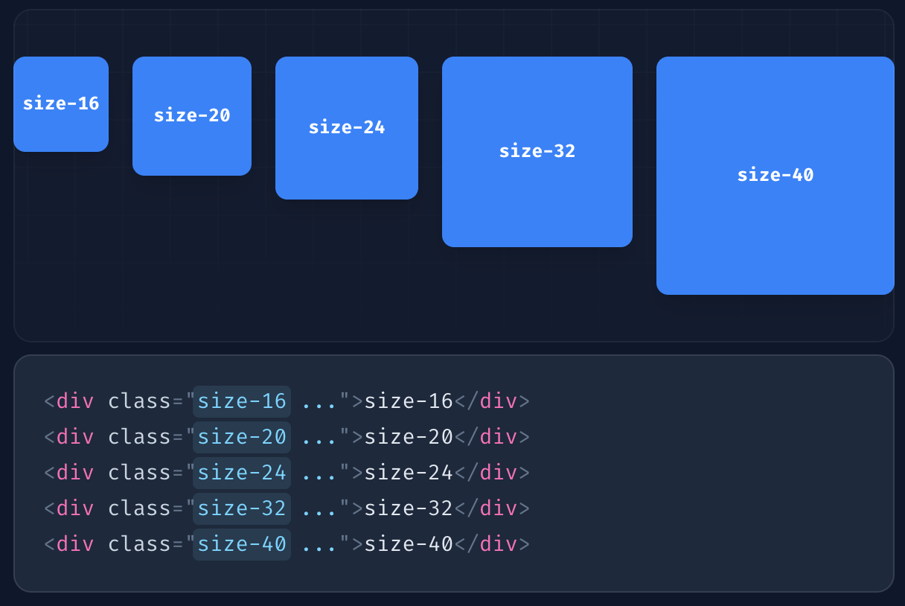

# Sizing

## 常规使用

| Class | Properties                |
| ----- | ------------------------- |
| w-0.5 | width: 0.125rem; /*2px*/  |
| w-1   | width: 0.25rem; /*4px*/   |
| w-1.5 | width: 0.375rem; /*6px*/  |
| w-2   | width: 0.5rem; /*8px*/    |
| w-2.5 | width: 0.625rem; /*10px*/ |
| w-3   | width: 0.75rem; /*12px*/  |

## 比例使用

在`flex`布局中，可以通过百分比来设置宽度

比如`w-full`, `w-1/2`, `w-2/5` 如图所示

## 视口

使用`w-screen`可以让元素撑满整个视口

## 高度的使用同理

## 最大最小宽度

| Class   | Properties                   |
| ------- | ---------------------------- |
| min-w-0 | min-width: 0px;              |
| min-w-1 | min-width: 0.25rem; /*4px*/  |
| min-w-2 | min-width: 0.5rem; /*8px*/   |
| min-w-3 | min-width: 0.75rem; /*12px*/ |
| min-w-4 | min-width: 1rem; /*16px*/    |

## Sizing

| Class    | Properties                                           |
| -------- | ---------------------------------------------------- |
| size-0   | width: 0px; height: 0px;                             |
| size-px  | width: 1px; height: 1px;                             |
| size-0.5 | width: 0.125rem; /*2px */ height: 0.125rem; /* 2px*/ |
| size-1   | width: 0.25rem; /*4px */  height: 0.25rem; /* 4px*/  |
| size-1.5 | width: 0.375rem; /*6px */ height: 0.375rem; /* 6px*/ |

撑满父级元素可以使用`w-full h-full`,相同作用的简写为`sizing-full`

