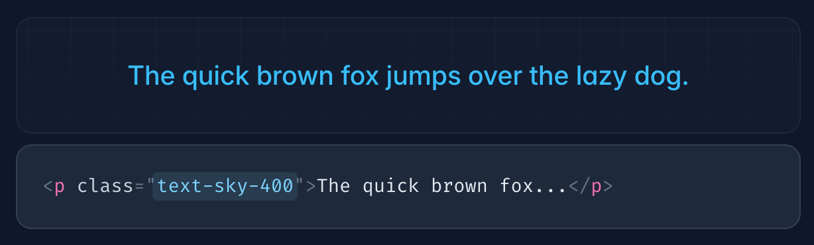
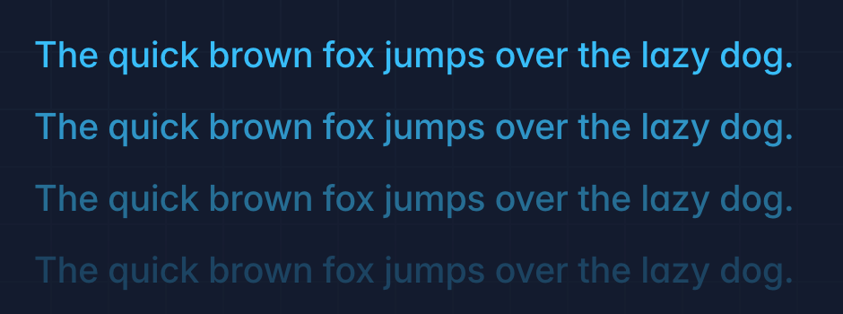
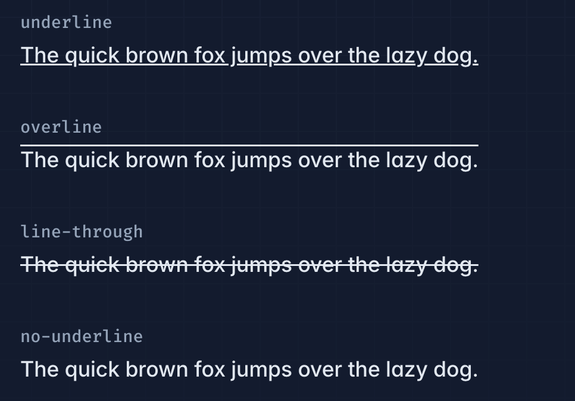
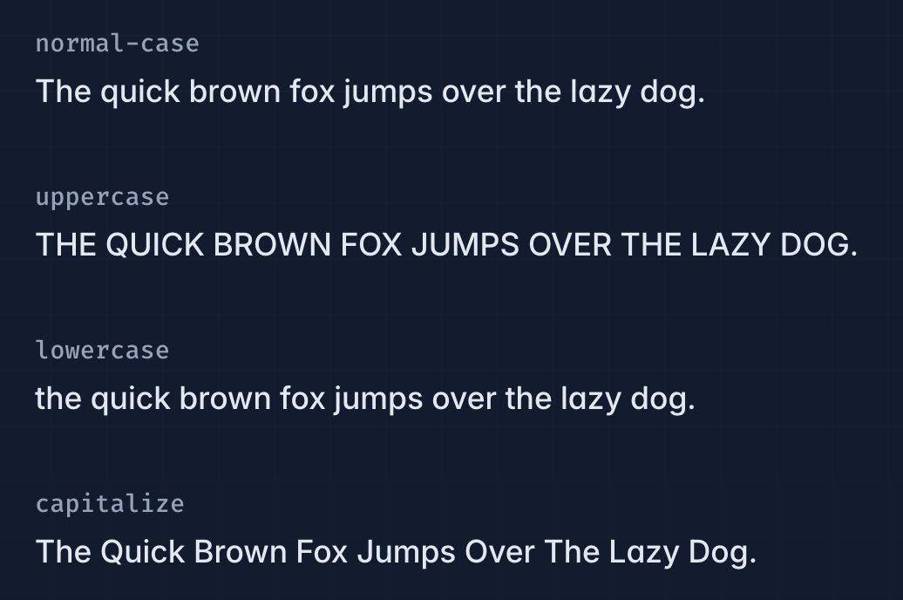
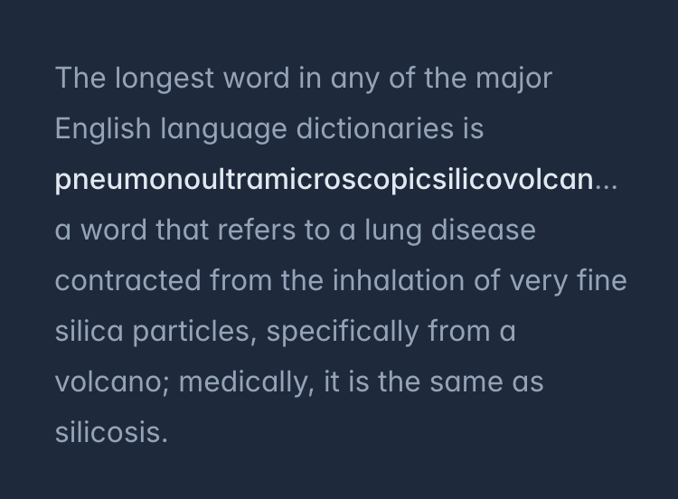
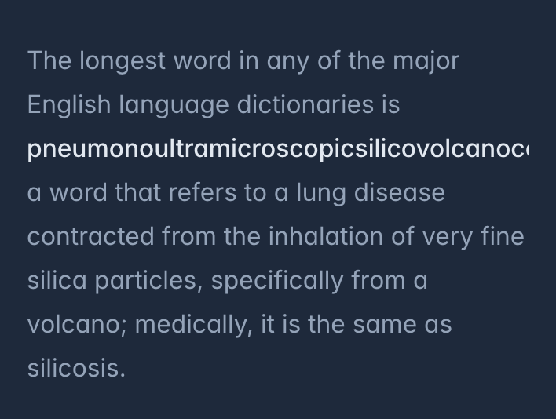

# Text

## Text Align

| Class        | Properties           |
| ------------ | -------------------- |
| text-left    | text-align: left;    |
| text-center  | text-align: center;  |
| text-right   | text-align: right;   |
| text-justify | text-align: justify; |
| text-start   | text-align: start;   |
| text-end     | text-align: end;     |

## Text Color

| Class            | Properties               |
| ---------------- | ------------------------ |
| text-inherit     | color: inherit;          |
| text-current     | color: currentColor;     |
| text-transparent | color: transparent;      |
| text-black       | color: rgb(0 0 0);       |
| text-white       | color: rgb(255 255 255); |
| text-slate-50    | color: rgb(248 250 252); |
| text-slate-100   | color: rgb(241 245 249); |
| text-slate-200   | color: rgb(226 232 240); |



### 字体透明度

```html
<p class="text-sky-400/100">The quick brown fox...</p>
<p class="text-sky-400/75">The quick brown fox...</p>
<p class="text-sky-400/50">The quick brown fox...</p>
<p class="text-sky-400/25">The quick brown fox...</p>
<p class="text-sky-400/0">The quick brown fox...</p>
```



### Hover, Focus

```html
<p class="text-slate-400 hover:text-sky-400">The quick brown fox...</p>
```

### Text Decoration

| Class        | Properties                          |
| ------------ | ----------------------------------- |
| underline    | text-decoration-line: underline;    |
| overline     | text-decoration-line: overline;     |
| line-through | text-decoration-line: line-through; |
| no-underline | text-decoration-line: none;         |

```html
<p class="underline ...">The quick brown fox ...</p>
<p class="overline ...">The quick brown fox ...</p>
<p class="line-through ...">The quick brown fox ...</p>
<p class="no-underline ...">The quick brown fox ...</p>
```



`Hover` `Focus` 同理

## Text Transform

| Class       | Properties                  |
| ----------- | --------------------------- |
| uppercase   | text-transform: uppercase;  |
| lowercase   | text-transform: lowercase;  |
| capitalize  | text-transform: capitalize; |
| normal-case | text-transform: none;       |

```html
<p class="normal-case ...">The quick brown fox ...</p>
<p class="uppercase ...">The quick brown fox ...</p>
<p class="lowercase ...">The quick brown fox ...</p>
<p class="capitalize ...">The quick brown fox ...</p>
```



## Text Overflow

| Class         | Properties                                                     |
| ------------- | -------------------------------------------------------------- |
| truncate      | overflow: hidden;text-overflow: ellipsis; white-space: nowrap; |
| text-ellipsis | text-overflow: ellipsis;                                       |
| text-clip     | text-overflow: clip;                                           |

### truncate

```html
<p class="truncate ...">...</p>
```


### ellipsis

```html
<p class="text-ellipsis overflow-hidden ...">...</p>
```



### clip

```html
<p class="text-clip overflow-hidden ...">...</p>
```

